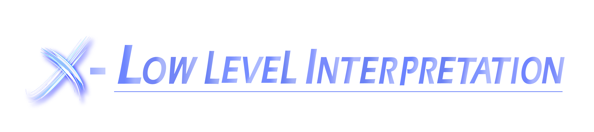
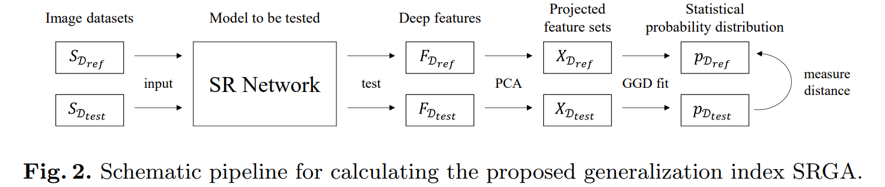
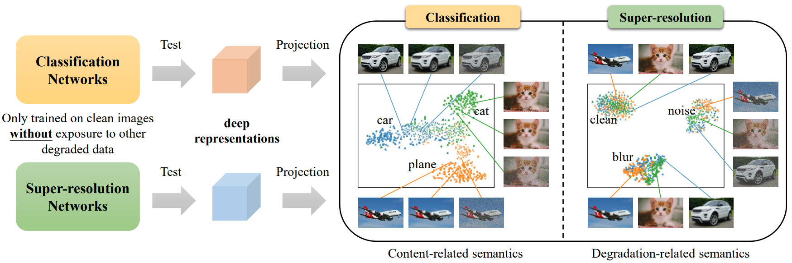
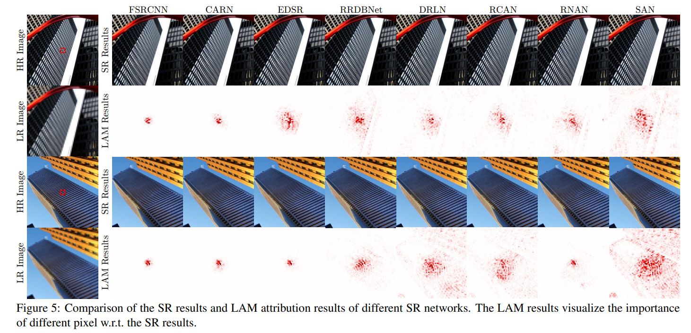
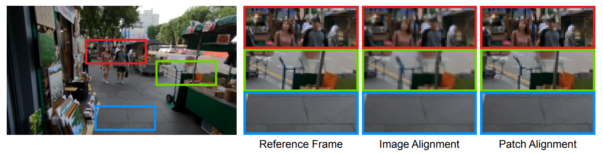
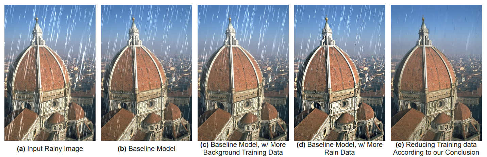

  
  

    <b>XPixel Homepage</b>
    
      <a href="http://xpixel.group/">
        <i>HOT</i>
      </a>
    
  

  
&nbsp;

English | [简体中文](README_zh-CN.md)

# Introduction

**X-Low-Level-Interpretation** is dedicated to presenting the research efforts of XPixel in interpretating the principle of neural networks in low-level vision field. The interpretability of neural networks refers to the ability to **understand and explain the decisions made by these networks**, which is helpful for understanding model behaviors and improving model performance.

# Full list

- [Evaluating the Generalization Ability of Super-Resolution Networks](#generalization)
- [Discovering Distinctive "Semantics" in Super-Resolution Networks](#semantics)
- [Interpreting Super-Resolution Networks with Local Attribution Maps](#lam)
- [Rethinking Alignment in Video Super-Resolution Transformers](#rethinking)
- [Networks are Slacking Off: Understanding Generalization Problem in Image Deraining](#derain)

# Papers

## Evaluating the Generalization Ability of Super-Resolution Networks

Research on the generalization ability of Super-Resolution (SR) networks is currently absent. We make the first attempt to propose a Generalization Assessment Index for SR networks, namely SRGA. SRGA exploits the statistical characteristics of internal features of deep networks, not output images to measure the generalization ability. To better validate our method, we collect a patch-based image evaluation set (PIES) that includes both synthetic and real-world images, covering a wide range of degradations. With SRGA and PIES dataset, we benchmark existing SR models on the generalization ability.

  

- **Authors**: Yihao Liu, Hengyuan Zhao, Jinjin Gu, Yu Qiao, Chao Dong
- **Links**: :scroll:[`paper`](https://arxiv.org/abs/2205.07019)

## Discovering Distinctive "Semantics" in Super-Resolution Networks

In this paper, we make the primary attempt to answer the following fundamental questions for Image super-resolution (SR):

1. Can SR networks learn semantic information?
2. What hinders SR networks from generalizing to real-world data?

After comprehensively analyzing the feature representations (via dimensionality reduction and visualization), we successfully discover the distinctive "semantics" in SR networks. We show that a well-trained deep SR network is naturally a good descriptor of degradation information. Our experiments also reveal two key factors (adversarial learning and global residual) that influence the extraction of such semantics.

  

- **Authors**: Yihao Liu, Anran Liu, Jinjin Gu, Zhipeng Zhang, Wenhao Wu, Yu Qiao, Chao Dong
- **Links**: :scroll:[`paper`](https://arxiv.org/abs/2108.00406)

## Interpreting Super-Resolution Networks with Local Attribution Maps

Image super-resolution (SR) techniques have been developing rapidly, benefiting from the invention of deep networks and its successive breakthroughs. In this paper, we propose a novel attribution approach called local attribution map (LAM), which performs attribution analysis of SR networks and aims at finding the input pixels that strongly influence the SR results. Based on LAM, we show that: 
1. SR networks with a wider range of involved input pixels could achieve better performance.
2. Attention networks and non-local networks extract features from a wider range of input pixels.
3. Comparing with the range that actually contributes, the receptive field is large enough for most deep networks.
4. For SR networks, textures with regular stripes or grids are more likely to be noticed, while complex semantics are difficult to utilize.

  

- **Authors**: Jinjin Gu, Chao Dong
- Accepted at CVPR'21
- **Links**: :scroll:[`paper`](https://arxiv.org/abs/2011.11036) :house:[`project`](https://x-lowlevel-vision.github.io/lam.html)

## Rethinking Alignment in Video Super-Resolution Transformers

The alignment of adjacent frames is considered an essential operation in video super-resolution (VSR). Advanced VSR models are generally equipped with well-designed alignment modules. In this paper, we rethink the role of alignment in VSR Transformers and make several counter-intuitive observations. Our experiments show that: (i) VSR Transformers can directly utilize multi-frame information from unaligned videos, and (ii) existing alignment methods are sometimes harmful to VSR Transformers. Based on these observations, we propose a new and efficient alignment method called patch alignment, which aligns image patches instead of pixels. VSR Transformers equipped with patch alignment could demonstrate state-of-the-art performance on multiple benchmarks.

  

- **Authors**: Shuwei Shi, Jinjin Gu, Liangbin Xie, Xintao Wang, Yujiu Yang, Chao Dong
- Accepted at NIPS'22
- **Links**: :scroll:[`paper`](https://arxiv.org/abs/2207.08494) :computer:[`code`](https://github.com/XPixelGroup/RethinkVSRAlignment)

## Networks are Slacking Off: Understanding Generalization Problem in Image Deraining

A prevailing perspective in deep learning encourages the use of highly complex training data for overcoming the generalization problem. However, we discovered that:

1. This strategy does **not** enhance the generalization capability of deraining networks. On the contrary, it exacerbates the tendency of networks to overfit to specific degradations.
2. Better generalization in a deraining network can be achieved by simplifying the complexity of the training data.

This is due to **the networks are learning the least complex elements to minimize training loss**. When the complexity of the background image is less than that of the rain streaks, the network will prioritize the reconstruction of the background, thereby avoiding overfitting to the rain patterns and resulting in improved generalization performance.

  

- **Authors**: Jinjin Gu, Xianzheng Ma, Xiangtao Kong, Yu Qiao, Chao Dong
- **Links**: :scroll:[`paper`](https://arxiv.org/abs/2305.15134)

# License

This project is released under the [Apache 2.0 license](LICENSE).

# Projects in Open-XSource

- [X-Super Resolution](https://github.com/XPixelGroup/X-Super-Resolution): Algorithms in the realm of image super-resolution.
- [X-Image Processing](https://github.com/XPixelGroup/X-Image-Processing): Algorithms in the realm of image restoration and enhancement.
- [X-Video Processing](https://github.com/XPixelGroup/X-Video-Processing): Algorithms for processing videos.
- [X-Low level Interpretation](https://github.com/XPixelGroup/X-Low-level-Interpretation): Algorithms for interpreting the principle of neural networks in low-level vision field.
- [X-Evaluation and Benchmark](https://github.com/XPixelGroup/X-Evaluation-and-Benchmark): Datasets for training or evaluating state-of-the-art algorithms.
